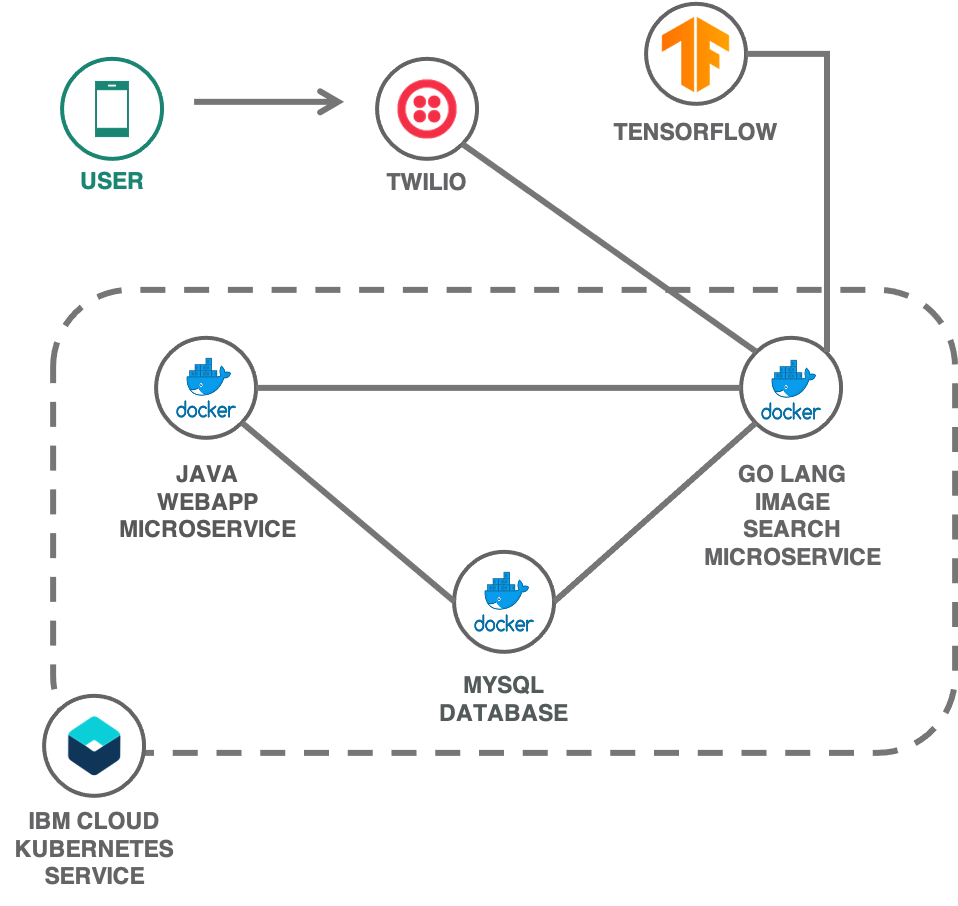
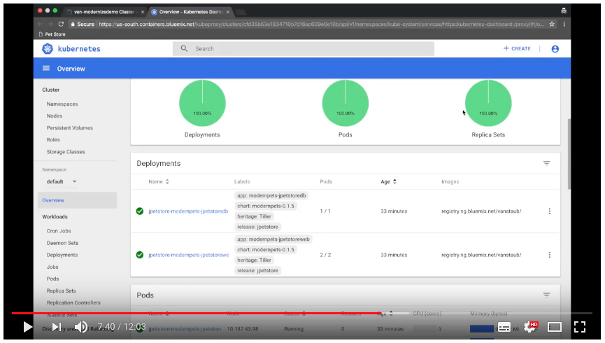
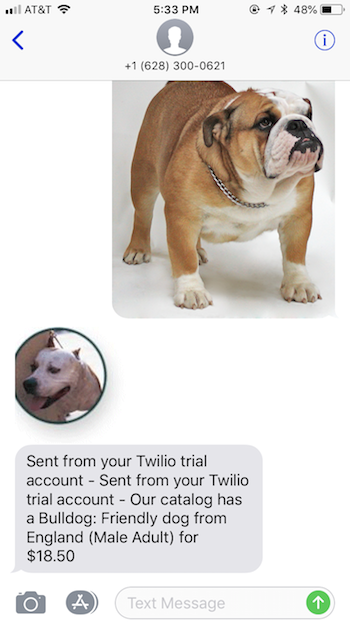

# Modernize and Extend: JPetStore on IBM Cloud Kubernetes Service

This demo modernizes an existing Java web application (JPetStore) by:

1. building Docker containers from the legacy stack
2. moving the app to [IBM Cloud Kubernetes Service](https://www.ibm.com/cloud/container-service)
3. and extending it with image(visual) classification and [Twilio](https://www.twilio.com/) text messaging (or a web chat interface).

IBMers can access the demo script and additional collateral from [here](https://github.ibm.com/Bluemix/cloud-portfolio-solutions/tree/master/demos/modernize-jpetstore).



[](https://youtu.be/26RjSa0UZp0 "Containerized Applications with IBM Cloud Kubernetes")

## Before you begin

Follow the below steps to create IBM Cloud services and resources used in this demo. You will create a Kubernetes cluster, and an optional [Twilio](https://www.twilio.com/) account (if you want to shop for pets using text messaging).

1. If you do not have Docker or Kubernetes tooling installed, see [Setting up the IBM Cloud Developer Tools CLI](https://cloud.ibm.com/docs/cli?topic=cloud-cli-getting-started#step1-install-idt).

2. Set up a cluster by going to the [Kubernetes Service on IBM Cloud](http://www.ibm.com/cloud/container-service) and [provision a Standard **Paid** cluster](https://cloud.ibm.com/docs/containers/container_index.html#clusters) (it might take up to 15 minutes to provision, so be patient). A Free cluster will *not* work because this demo uses Ingress resources.

3. Follow the instructions in the **Access** tab of your cluster to gain access to your cluster using [**kubectl**](https://kubernetes.io/docs/reference/kubectl/overview/).

4. **Optionally** visit [Twilio](http://twilio.com), sign up for a free account and **buy a number** with MMS capabilities by creating a project/feature on the Dashboard. Locate the **Account SID** and **Auth Token** from the API Credentials in the [dashboard](https://www.twilio.com/console/sms/dashboard#). Locate you **Phone Number** on the respective [Twilio page](https://www.twilio.com/console/phone-numbers/incoming).

## Automated deployment

A toolchain has been created and automates deployment of the demo. You will still need to manually configure Twilio as described in the Manual deployment section.

[](https://cloud.ibm.com/devops/setup/deploy/?repository=https%3A//github.com/IBM-Cloud/jpetstore-kubernetes)

Once the toolchain has completed, the applications will be available at `https://jpetstore.<your-cluster-ingress-domain>` and `https://mmssearch.<your-cluster-ingress-domain>`.

The toolchain includes a stage named **UNINSTALL (manual)**. This stage can only be triggered manually and will remove all resources created by the toolchain.

## Manual deployment

To manually deploy the demo, follow the below steps.

### Clone the demo to your laptop

Clone the demo repository:

```bash
git clone https://github.com/ibm-cloud/jpetstore-kubernetes
cd jpetstore-kubernetes
```

#### Code structure

| Folder | Description |
| ---- | ----------- |
|[**jpetstore**](/jpetstore)| Traditional Java JPetStore application |
|[**mmssearch**](/mmssearch)| New Golang microservice (used to identify the content of an image) |
|[**helm**](/helm)| Helm charts for templated Kubernetes deployments |
|[**pet-images**](/pet-images)| Pet images (which can be used for the demo) |

### Create a Kubernetes secret

1. Create a file with the name **mms-secrets.json** by using the existing template:

   ```bash
   # from jpetstore-kubernetes directory
   cd mmssearch
   cp mms-secrets.json.template mms-secrets.json
   ```

2. Run `ibmcloud ks cluster get --cluster CLUSTER_NAME` to get your **Ingress Subdomain** (make sure to replace CLUSTER_NAME with the name of the cluster you created above).

3. Open **mms-secrets.json** file and update the **Ingress Subdomain** in the **jpetstoreurl** field. This allows the mmssearch microservice to find the images that are part of the message back to the user.
   Example: `http://jpetstore.yourclustername.us-south.containers.appdomain.cloud `


### Set up Twilio (optional)

This step is only required if you want to use MMS text messaging during the demo (which is not possible in many countries outside the U.S.).

Skip this section if you only want to interact using the web chat.

1. Visit [Twilio](http://twilio.com), sign up for a free account and **buy a number** with MMS capabilities by creating a project/feature on the Dashboard.
2. Open the **mms-secrets.json** file and replace:

   1.  **sid** and **token** values with your **AccountSID** and the **AuthToken** from the Twilio Account Dashboard.
   2.  **number** with the number you just purchased in the format **+1XXXYYYZZZZ**.

3. Configure Twilio to send messages to the MMSSearch service
   1. Go to **Manage Numbers** on Twilio dashboard by clicking on **All Products & Services** on the left pane then click on your number.
   2. In the **Messaging** section of the **Configure** page under **A message comes in**, select **Webhook**, set the URL to `http://mmssearch.<Ingress Subdomain>/sms/receive` and the METHOD to **HTTP POST**


### Create Kubernetes secrets

Next, use the `kubectl` command to allow your Kubernetes cluster access to the secrets you just created. This will allow it to access the JPetStore frontend and Twilio services:

```bash
# from the jpetstore-kubernetes directory
cd mmssearch
kubectl create secret generic mms-secret --from-file=mms-secrets=./mms-secrets.json
```

## Build and push the container images

The docker images for each of the micro-services need to be built and then pushed to a container registry. Here are the steps for pushing to your IBM Cloud private registry, but be aware that you could also push them to a public registry.

1. Identify your registry **Namespace** with `ibmcloud cr namespaces` or create a new one using `ibmcloud cr namespace-add <NAMESPACE>`

2. Set MYNAMESPACE env var to your namespace.

   `export MYNAMESPACE=<NAMESPACE>`

3. Identify your **Container Registry** (e.g. us.icr.io) by running `ibmcloud cr info`.

4. Set MYREGISTRY env var to your registry.

   `export MYREGISTRY=<REGISTRY>`

5. Make sure that the steps above worked by running `echo ${MYREGISTRY}/${MYNAMESPACE}` . You should see output similar to `us.icr.io/mynamespace`

6. Build and push the **jpetstoreweb** image. Run these commands as they are. You do not need to replace any of the values belwo:

   ```bash
   # from the jpetstore-kubernetes directory
   cd jpetstore
   docker build . -t ${MYREGISTRY}/${MYNAMESPACE}/jpetstoreweb
   docker push ${MYREGISTRY}/${MYNAMESPACE}/jpetstoreweb
   ```
   If you see `Unauthorized ` while pushing the image, run `ibmcloud cr login` to ensure you are logged into the IBM Cloud and have access to the container registry.

7. Next, build and push the **jpetstoredb** image:

   ```bash
   # from the jpetstore directory
   cd db
   docker build . -t ${MYREGISTRY}/${MYNAMESPACE}/jpetstoredb
   docker push ${MYREGISTRY}/${MYNAMESPACE}/jpetstoredb
   ```

8. Build and push the **mmssearch** image:

   ```bash
   # from the db directory
   cd ../../mmssearch
   docker build . -t ${MYREGISTRY}/${MYNAMESPACE}/mmssearch
   docker push ${MYREGISTRY}/${MYNAMESPACE}/mmssearch
   ```

9. Finally make sure that all three images have been successfully pushed to the IBM Cloud container registry by running `ibmcloud cr images --restrict $MYNAMESPACE` .

## Deploy the application

There are two different ways to deploy the three micro-services to a Kubernetes cluster:

- Using [Helm](https://helm.sh/) to provide values for templated charts (recommended)
- Or, updating yaml files with the right values and then running  `kubectl create`

### Option 1: Deploy with Helm (recommended)

1. Install [Helm](https://docs.helm.sh/using_helm/#installing-helm). (`brew install kubernetes-helm` on MacOS)

2. Find your **Ingress Subdomain** by running `ibmcloud ks cluster get --cluster YOUR_CLUSTER_NAME` , it will look similar to "mycluster.us-south.containers.appdomain.cloud".

3. Open `../helm/modernpets/values.yaml` and make the following changes.

    - Update `repository` and replace `<REGISTRY>` with your Container Registry and `<NAMESPACE>` with your Container Registry namespace.
    - Update `hosts` and replace `<Ingress Subdomain>` with your Ingress Subdomain.

4. Repeat the previous step and update `../helm/mmssearch/values.yaml` with the same changes.

5. Next, install JPetStore and Visual Search using the helm yaml files you just created:

    ```bash
    # Change into the helm directory
    cd ../helm

    # Create the JPetstore app
    helm install jpetstore ./modernpets

    # Ceate the MMSSearch microservice
    helm install mmssearch ./mmssearch
    ```

### Option 2: Deploy using YAML files

If you did not deploy using Helm, you can deploy using the yaml files and kubectl. For this option, you need to update the YAML files to point to your registry namespace and Kubernetes cluster Ingress subdomain:

1. Edit **jpetstore/jpetstore.yaml** and **jpetstore/jpetstore-mmssearch.yaml** and replace all instances of:

  - `<CLUSTER DOMAIN>` with your Ingress Subdomain (`ibmcloud ks cluster get --cluster CLUSTER_NAME`)
  - `<REGISTRY NAMESPACE>` with your Image registry URL. For example:`us.icr.io/mynamespace`

2. `kubectl create -f jpetstore.yaml`  - This creates the JPetstore app and database microservices
3. `kubectl create -f jpetstore-mmssearch.yaml`  - This creates the MMSSearch microservice

## You're Done!

You are now ready to use the UI to shop for a pet or query the store by sending it a picture of what you're looking at:

1. Access the java jpetstore application web UI for JPetstore at `http://jpetstore.<Ingress Subdomain>/shop/index.do`

   

2. Access the mmssearch app and start uploading images from `pet-images` directory.

   

3. If you configured Twilio, send a picture of a pet to your Twilio number via your phone. The app should respond with an available pet from the store or or with a message that this type of pet is not available:


   

## Using your Mac to send text messages to Twilio

If you'd like to send and receive texts from the pet store on your Mac, do the following steps:

1. Ensure your iPhone is capable of forwarding text messages to your Mac.
    - See this [Apple support document](https://support.apple.com/en-us/HT208386).
    - If the Text Message Forwarding option is not present, confirm that your Apple ID is enabled under **Send & Receive**.
2. Access the [Getting Started page](https://www.twilio.com/console/sms/getting-started/build) from your Twilio account home page
3. In the **Send a Message** widget, enter the Twilio number you bought into the **To:** text field.
4. Add a message to the **Body** text field and click the **Make Request** button.
5. After receiving the message on your Mac, drag and drop an image into the iMessage window

## Logging

Check this tutorial - [Analyze logs and monitor application health with LogDNA and Sysdig](https://cloud.ibm.com/docs/solution-tutorials?topic=solution-tutorials-application-log-analysis)

## Monitoring

Check this tutorial - [Analyze logs and monitor application health with LogDNA and Sysdig](https://cloud.ibm.com/docs/solution-tutorials?topic=solution-tutorials-application-log-analysis#monitor_cluster_sysdig)

### Load Generation for demo purposes

In a demo situation, you might want to generate load for your application (it will help illustrate the various features in the dashboard). This can be done through the loadtest package:

```bash
# Use npm to install loadtest
npm install -g loadtest

# Geneate increasing load (make sure to replace <Ingress Subdomain> with your ingress subdomain)
loadtest http://jpetstore.<Ingress Subdomain>/
```

## Clean up

```bash
# Use "helm delete" to delete the two apps
helm uninstall jpetstore
helm uninstall mmssearch

# Delete the secrets stored in our cluster
kubectl delete secret mms-secret

# Remove the container images from the registry
ibmcloud cr image-rm ${MYREGISTRY}/${MYNAMESPACE}/mmssearch
ibmcloud cr image-rm ${MYREGISTRY}/${MYNAMESPACE}/jpetstoreweb
ibmcloud cr image-rm ${MYREGISTRY}/${MYNAMESPACE}/jpetstoredb

# Delete your entire cluster!
ibmcloud ks cluster rm --cluster yourclustername
```

## Troubleshooting

### The toolchain DEPLOY fails with an UPGRADE FAILED error

The DEPLOY log shows:
```
Error: UPGRADE FAILED: "mmssearch" has no deployed releases
```

There is a known helm issue. If an install of a given release fails the very first time it was attempted, all subsequent install (upgrade) attempts of that release will fail.  To fix, for example in the case of the exact error above related to mmssearch, you can issue a `helm delete mmssearch --purge` command. This command can be added in the deploy script right before issuing the `helm upgrade --install ....` command.


## Related Content

IBM Cloud solution tutorial: [Migrate web applications from Virtual Machines to Kubernetes](https://cloud.ibm.com/docs/solution-tutorials?topic=solution-tutorials-vm-to-containers-and-kubernetes)
